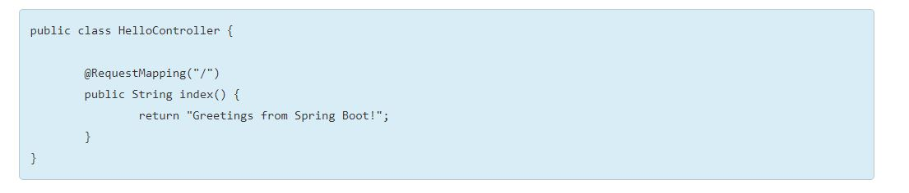

# TALLER 1 EN CLASE - AREP (Taller de Arquitecturas de Servidores de Aplicaciones, Meta protocolos de objetos, Patrón IoC, Reflexión)

## Descripción

Para este taller los estudiantes deberán construir un servidor Web (tipo Apache) en Java. El servidor debe ser capaz de entregar páginas html e imágenes tipo PNG. Igualmente el servidor debe proveer un framework IoC para la construcción de aplicaciones web a partir de POJOS. Usando el servidor se debe construir una aplicación Web de ejemplo y desplegarlo en Heroku. El servidor debe atender múltiples solicitudes no concurrentes.

Para este taller desarrolle un prototipo mínimo que demuestre capcidades reflexivas de JAVA y permita por lo menos cargar un bean (POJO) y derivar una aplicación Web a partir de él. Debe entregar su trabajo al final del laboratorio.

### Sugerencia

1.Cargue el POJO desde la línea de comandos , de manera similar al framework de TEST. Es decir pásela como parámetro cuando invoke el framework. Ejemplo de invocación:

```
java -cp target/classes co.edu.escuelaing.reflexionlab.MicroSpringBoot co.edu.escuelaing.reflexionlab.FirstWebService
```

2. Atienda la anotación @ResuestMapping publicando el servicio en la URI indicada, limítelo a tipos de retorno String,  ejemplo:



## AUTHOR

* **JUAN CAMILO ORTIZ MEDINA** - [Juaco9502](https://github.com/juaco9502)


## LICENSE

This project is licensed under the GNU General Public License - [LICENSE](LICENSE) 